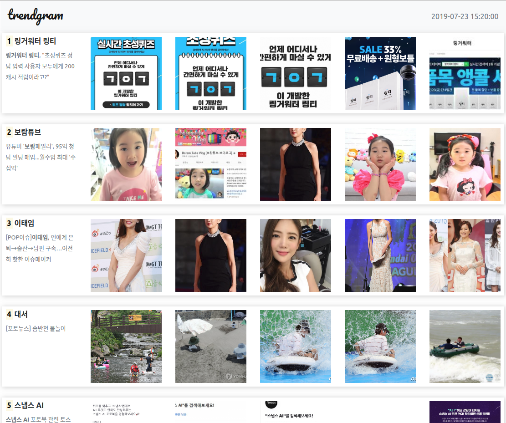

## [트렌드그램 Trendgram](http://trendgram.util.kr)

사진으로 보는 실시간 트렌드

네이버 실시간 검색어 20위까지의 키워드를 이용해 관련 뉴스를 가져온 후 뉴스의 이미지를 보여줌으로써 한눈에 어떤 뉴스와 이슈인지 알 수 있게 해줍니다.주기적인 작업을 CeleryBeat로 생성 후 Celery로 처리, Redis에 저장하여 서비스하고 직접 구현한 REST API의 인증키 검증 로직으로 통해 인증되지 않은 곳으로부터 호출을 차단합니다. 인증키는 Postgres를 DB로 사용하는 Django admin에서 쉽게 생성/삭제할 수 있고, API요청 인증 성공 및 실패 시 관련 클라이언트 정보를 로그로 남겨 모니터링 하게 되어 있습니다.

> 

---

## [모두의 대자보](https://daejabo.util.kr/)

온라인 대자보 공유 서비스

학교의 대자보는 우리 사회에서 거의 유일하게 외부의 압력과 금전적 유혹에 굴복하지 않고 스스로의 목소리를 내는 훌륭한 광장의 역할을 하고 있습니다. 때로는 편향적 의견에 다수의 반대 의견에 맞서야 하기도 하며, 때로는 큰 사회적 공감대를 얻어 뉴스와 신문 기사를 통해 더 큰 생각의 장을 만들어 내기도 합니다. ‘모두의 대자보’는 이런 대자보가 얼마나 큰 노력과 가치가 담겨 있는지 잘 알고 있습니다. 그래서 사진으로만 공유되던 대자보를 검색 엔진을 통해서도 검색할 수 있도록 하자고 생각했습니다. 그들의 생각이 더 널리 알려지게 하자. 함부로 훼손되거나 비가 오면 찢겨 나가는 일회용이 아니라 영속적 가치를 지니며 어떻게 올바른 방법으로 사회를 한 발 더 앞으로 나가게 만드는지 보여주자! 라고 생각했습니다. ... 대자보는 단 한 장의 종이가 아니라 너와 나에게 보내는 위로이며, 썩고 감추어진 진실을 드러내는 날카로운 펜입니다.

> 

---

## [한국어 맞춤법 검사기](https://chrome.google.com/webstore/detail/%ED%95%9C%EA%B5%AD%EC%96%B4-%EB%A7%9E%EC%B6%A4%EB%B2%95-%EA%B2%80%EC%82%AC%EA%B8%B0/jglndaljomjcobaaoohfccecjcekcfgo?hl=ko)

크롬 브라우저에서 손쉽게 맞춤법을 검사할 수 있는 확장 프로그램

2019년 7월 현재 약 5,577명의 활성 사용자가 이용 중인 한국어 맞춤법 검사기입니다. 웹페이지의 문장뿐만 아니라 직접 문장을 입력해 순식간에 맞춤법 검사를 수행할 수 있습니다. 단축키 기능은 정말 편리하죠. 어떻게 동작하는지 데모 영상을 통해 확인하세요.

-   [100명 넘었을 때 썼던 글](https://blog.jwgo.kr/korean-spelling-checker-first-release/)
-   [200명 넘었을 때 썼던 글](https://blog.jwgo.kr/korean-spelling-checker/)
-   [유튜브 데모영상](https://youtu.be/6nt_1zCK06s)

> 

---

## [키즈노트 사진/동영상 다운로더](https://chrome.google.com/webstore/detail/%ED%82%A4%EC%A6%88%EB%85%B8%ED%8A%B8%EC%97%90%EC%84%9C-%EC%82%AC%EC%A7%84%EB%8F%99%EC%98%81%EC%83%81-%EB%8B%A4%EC%9A%B4%EB%A1%9C%EB%93%9C-%EB%B0%9B%EA%B8%B0/dglhbebhfdidbfoeknnfghdbleecgopl)

키즈노트에서 사진을 일괄다운로드 할 수 있는 크롬 브라우저 확장 프로그램

스마트 알림장 '키즈노트(kidsnote.com)'의 사진과 동영상을 일괄 다운로드 받는 확장 프로그램입니다. 아이의 사진과 동영상을 일일이 눌러 다운로드를 받는 불편함과 번거로움을 줄이기 위해 만들었습니다.

-   [제작후기](https://blog.jwgo.kr/kidsnote-downloader/)
-   [착한 키즈노트의 나쁜 생각](https://blog.jwgo.kr/good-kidsnote-bad-profit/)
-   [프라이머 권도균 대표님의 코멘트](img/kidenote_share.png)

> 

---

## [부천시 사회복지시설 지도](https://bsm.util.kr/)

부천시에 있는 사회복지시설을 각 카테고리별로 지도에 표시해주는 서비스

부천시에 있는 사회복지시설이 각 지역별, 카테고리별로 얼마나 존재하는지 지도에 표시하여 취약지구를 분석하는데 쓰였던 서비스입니다. 시설정보를 파싱하여 구글 API를 통해 위도, 경도를 추출하는 스크립트를 만들고 이를 리액트로 서비스합니다.

> 

---

## [직장인을 위한 뉴스 보기 서비스](http://http://trends.util.kr)

일하는 것처럼 뉴스를 볼 수 있는 서비스

네이버로 뉴스 좀 볼려고 하면 크고 선명한 녹색창이 너무 부담스러워서 회사에서 뉴스보기가 좀 그렇다는 지인의 말을 듣고 개발해 본 서비스입니다. 이미지와 같이 눈에 띄는 항목이 없고 제목은 엑셀업무활용법으로 나옵니다. 간단한 코멘트를 남길 수 있고 퇴근시간을 계산해줍니다.

> 

---

## [직장인을 위한 주가 확인 서비스](http://http://stock.util.kr)

일하면서 주가를 확인할 수 있는 서비스

실시간 주가를 보고 싶은데 계속 화면을 띄워놓기 그런 사람들을 위해 만들었습니다. 역시 주변 사람들이 불편하다고 한 이야기를 듣고 구현한 서비스입니다. 기업명을 검색하면 탭에 60초마다 실시간 주가가 나타납니다. 화면에는 일부러 하얗게 표시되도록 했고 마우스를 드래그 해보면 색상이 반전되면서 해당 기업명이 나타나도록 되어 있습니다. : )

> 

---

## [람다그램 lambdagram](https://pypi.org/project/lambdagram/)

람다그램은 텔레그램의 공식 API를 이용해 서버없이 AWS lambda에서 챗봇을 쉽게 만들 수 있도록 도와주는 라이브러리입니다.

웹훅(Webhook)을 지원하며 [PYPI](https://pypi.org/project/lambdagram/)에도 올라가있어 누구나 `pip install lambdagram`으로 다운로드 받을 수 있습니다. [깃허브](https://github.com/jwkcp/lambdagram)에서 소스를 볼 수 있고 외국에서도 사용할 가능성(?)이 있을 것 같아 README는 영어로 작성했습니다.

> 

---

## [테크니들 필진 활동](https://blog.jwgo.kr/non-personal-writing)

실리콘밸리의 소식을 한국어로 번역해 전하는 테크니들의 필진으로 활동했었습니다. 이 글은 zum.com의 허브줍에도 함께 게재되기도 했습니다.

테스트

> 

---

## [ㅍㅍㅅㅅ 필진 활동](https://www.google.com/search?q=%EB%A1%9C%EB%94%94%EC%95%84+site%3Appss.kr&oq=%EB%A1%9C%EB%94%94%EC%95%84+site%3Appss.kr&aqs=chrome..69i57.95984j0j1&sourceid=chrome&ie=UTF-8)

ㅍㅍㅅㅅ 에서 연락이 와 브런치의 글을 ㅍㅍㅅㅅ에 게재할 수 있도록 허락하는 방식으로 필진활동을 했었습니다. 지금은 브런치를 없애고 개인 워드프레스 블로그 운영으로 바꾸어서 ㅍㅍㅅㅅ에는 더 글이 올라가지 않지 않을까 생각합니다.

> 
